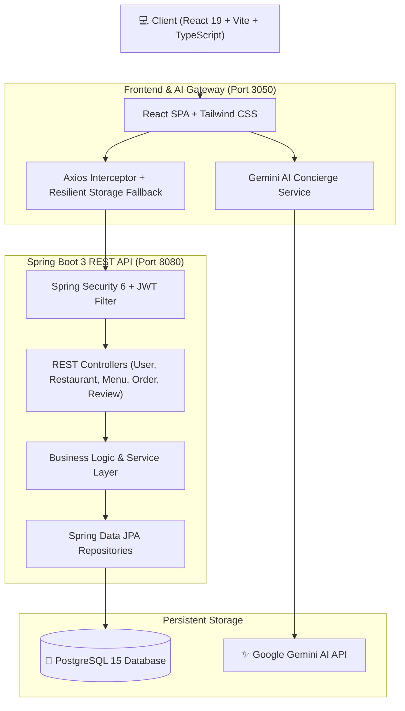

# 🍽️ CravingPoint AI — Intelligent Full-Stack Food Delivery Platform

[](https://reactjs.org/)
[](https://spring.io/projects/spring-boot)
[](https://www.typescriptlang.org/)
[](https://www.oracle.com/java/)
[](https://www.postgresql.org/)
[](https://aistudio.google.com/)
[](https://tailwindcss.com/)
[](https://www.docker.com/)

**CravingPoint AI** is a production-grade, enterprise-ready full-stack food delivery ecosystem that integrates modern web engineering with generative AI. It features a reactive, responsive frontend, a high-performance Spring Boot REST API, a resilient PostgreSQL data layer, and an AI culinary concierge powered by Google Gemini.

---

## 🏛️ System Architecture



---

## ✨ Key Features

### 🤖 1. Generative AI Gourmet Concierge
- **Conversational Food Guide**: Powered by Google Gemini 3.5 Flash to recommend dishes, calculate nutritional balance, and pair beverages based on user preferences.
- **Smart Query Completion**: Generates contextual culinary suggestions and smart combo pairings as users type in the search bar.

### 🍱 2. Restaurant & Menu Discovery
- Multi-cuisine catalog featuring South Indian, Hyderabadi Biryani, Pan-Asian, and Healthy Bowled cuisines.
- Dynamic filtering by cuisine type, veg/non-veg dietary preferences, rating, and preparation time.
- Verified customer reviews and dynamic aggregate rating computation.

### 🛒 3. Real-Time Cart & Order Lifecycle
- Synchronized cart with instant quantity adjustments, delivery fee calculators, and GST computation.
- Simulated delivery partner tracking timeline with live order state progressions (`Placed` ➔ `Confirmed` ➔ `Preparing` ➔ `Out for Delivery` ➔ `Delivered`).
- Interactive delivery map showing driver telemetry and ETA countdown.

### 🔒 4. Enterprise Security & Authentication
- Stateless JWT-based authentication with bcrypt password encryption.
- Role-based authorization policies and configured CORS for cross-origin safety.
- Token refresh interception in frontend Axios clients.

---

## 🛠️ Technology Stack

| Layer | Technologies & Tools |
| :--- | :--- |
| **Frontend UI** | React 19, TypeScript, Tailwind CSS v4, Lucide Icons, Motion |
| **Frontend Tooling** | Vite 6, tsx, esbuild, Axios |
| **Backend API** | Spring Boot 3.2.5, Java 17, Spring Security 6, Spring Data JPA, Lombok |
| **Authentication** | JSON Web Tokens (JJWT 0.11.5), BCrypt Hashing |
| **Database** | PostgreSQL 15, Hibernate ORM, SQL Seeding |
| **AI / LLM** | Google Gemini API (`@google/genai` 2.4) |
| **DevOps & Containers** | Docker, Docker Compose, Multi-stage builds |

---

## 📂 Monorepo Project Structure

```
CravingPoint-FullStack/
├── backend/                             # Spring Boot Java REST Application
│   ├── src/main/java/com/smartdelivery/
│   │   ├── config/                      # Security & CORS configuration
│   │   ├── controller/                  # Auth, Restaurant, Menu, Cart, Order, Review
│   │   ├── dto/                         # Data Transfer Objects & Validation
│   │   ├── entity/                      # JPA Database Entities
│   │   ├── repository/                  # Spring Data JPA Repositories
│   │   ├── security/                    # JWT Filters & Token Utilities
│   │   └── service/                     # Core Business Logic Layer
│   ├── src/main/resources/
│   │   ├── application.properties       # DB, Port, and JWT configurations
│   │   └── data.sql                     # Seed dataset (Restaurants & Menus)
│   ├── pom.xml                          # Maven dependencies & plugins
│   ├── Dockerfile                       # Multi-stage Java build
│   └── mvnw / mvnw.cmd                  # Maven wrappers
│
├── frontend/                            # React + TypeScript + Gemini AI App
│   ├── src/
│   │   ├── components/                  # UI Components, Cards, Map, Chat Modal
│   │   ├── pages/                       # Home, RestaurantDetails, Cart, Orders, Auth
│   │   ├── services/                    # Axios API client & Fallback Store
│   │   ├── types.ts                     # TypeScript Domain Models
│   │   ├── App.tsx                      # Main Application Router
│   │   └── index.css                    # Tailwind CSS Design System
│   ├── server.ts                        # Express Gemini AI API & Static Server
│   ├── vite.config.ts                   # Vite bundler & Backend proxy
│   ├── package.json                     # Frontend scripts & dependencies
│   ├── .env.example                     # Environment template
│   └── Dockerfile                       # Production Node container
│
├── docker-compose.yml                   # Multi-service container orchestration
├── package.json                         # Root workspace scripts
├── run-app.bat                          # One-click Windows starter
├── run-app.ps1                          # PowerShell starter
├── run-app.sh                           # macOS / Linux starter
├── .gitignore                           # Unified Git ignore rules
├── README.md                            # Main project documentation
└── RESUME_SNIPPETS.md                   # Ready-to-use resume bullet points & talking points
```

---

## 🚀 Quick Start Guide

### Option 1: Run with Docker Compose (Recommended)

Start the entire stack (PostgreSQL, Spring Boot backend, and React frontend) with a single command:

```bash
# 1. Clone the repository
git clone https://github.com/yaswanthkumar112006-maker/CravingPoint-FullStack.git
cd CravingPoint-FullStack

# 2. Configure environment (optional: add GEMINI_API_KEY)
cp .env.example .env

# 3. Start all services in Docker
docker-compose up --build
```
- **Web App & AI Concierge**: [http://localhost:3050](http://localhost:3050)
- **Spring Boot API**: [http://localhost:8080](http://localhost:8080)
- **PostgreSQL Database**: `localhost:5432`

---

### Option 2: Run Locally (Native Development)

#### Prerequisites
- **Node.js**: v18 or higher
- **Java JDK**: 17 or higher
- **PostgreSQL**: Local instance running on port 5432 (or run the app with built-in frontend resilience mode)

#### Fast 1-Click Launchers:
- **Windows**: Double-click `run-app.bat` or execute `./run-app.ps1`
- **macOS / Linux**: Execute `chmod +x run-app.sh && ./run-app.sh`

#### Manual Step-by-Step:
1. **Start the Backend**:
   ```bash
   cd backend
   ./mvnw spring-boot:run
   # On Windows: .\mvnw.cmd spring-boot:run
   ```
2. **Start the Frontend & AI Service**:
   ```bash
   cd frontend
   npm install
   npm run dev
   ```
3. Open [http://localhost:3050](http://localhost:3050) in your browser!

---

## 🔌 API Reference Overview

### Authentication & Users (`/api/auth` & `/api/users`)
| Method | Endpoint | Description | Auth Required |
| :--- | :--- | :--- | :---: |
| `POST` | `/api/auth/register` | Register a new user profile | ❌ |
| `POST` | `/api/auth/login` | Authenticate user and receive JWT | ❌ |
| `GET` | `/api/users/test` | Verify JWT token authentication | ✅ |

### Restaurants & Menus (`/api/restaurants` & `/api/menu-items`)
| Method | Endpoint | Description | Auth Required |
| :--- | :--- | :--- | :---: |
| `GET` | `/api/restaurants` | Get all listed restaurants | ❌ |
| `GET` | `/api/restaurants/{id}` | Get specific restaurant by ID | ❌ |
| `GET` | `/api/menu-items/restaurant/{id}` | Get dishes for a restaurant | ❌ |
| `POST` | `/api/restaurants` | Create restaurant listing | ✅ |

### Cart & Orders (`/api/cart` & `/api/orders`)
| Method | Endpoint | Description | Auth Required |
| :--- | :--- | :--- | :---: |
| `GET` | `/api/cart/{userId}` | Retrieve user active cart | ✅ |
| `POST` | `/api/cart/{userId}/{menuItemId}` | Add item to cart | ✅ |
| `POST` | `/api/orders/{userId}` | Place order from current cart | ✅ |
| `GET` | `/api/orders/{userId}` | Get order history and status | ✅ |

### AI Concierge (`/api/ai`)
| Method | Endpoint | Description |
| :--- | :--- | :--- |
| `POST` | `/api/ai/chat` | Conversational dish and cuisine recommendation |
| `POST` | `/api/ai/suggestions` | Smart search query completion & combo generation |

---

## 👨‍💻 Author & Contact

- **Developer**: Yaswanth Kumar
- **GitHub**: [@yaswanthkumar112006-maker](https://github.com/yaswanthkumar112006-maker)
- **Project**: CravingPoint AI Full-Stack Platform
- **License**: Apache 2.0
